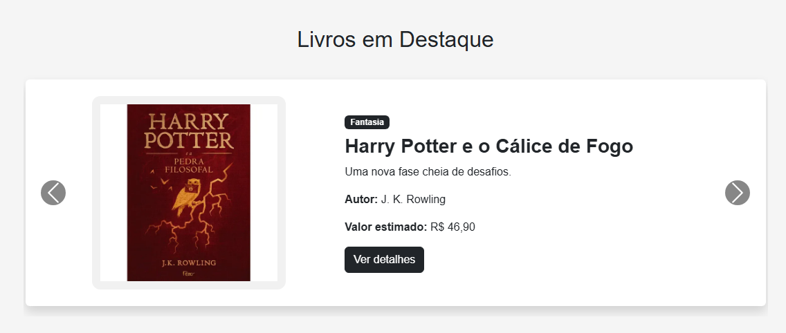
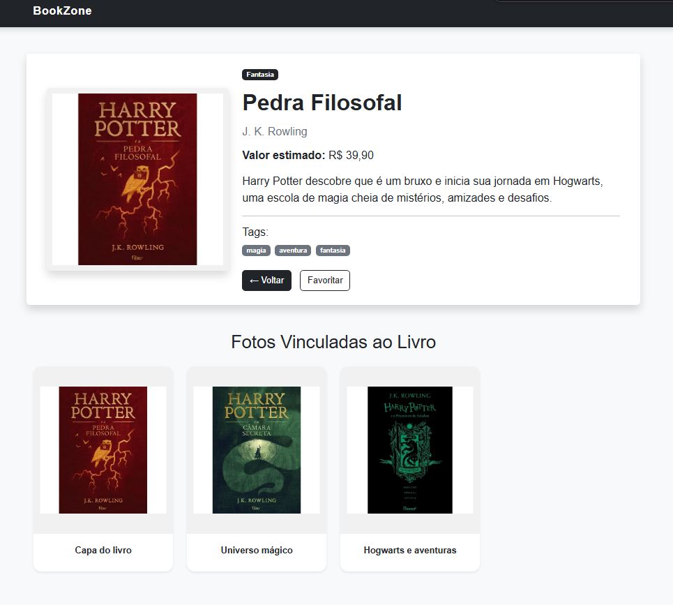
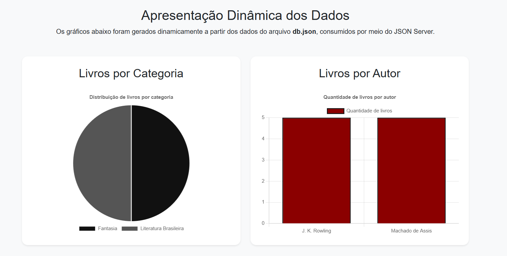
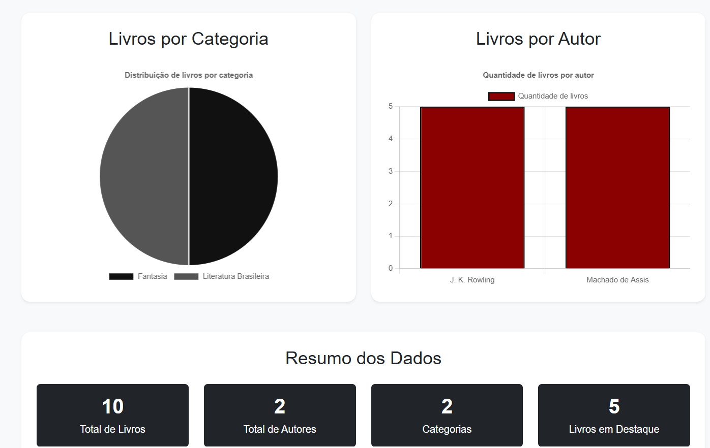

# Trabalho Prático - Semana 13

## Informações do Aluno

* **Aluno:** Felipe Gabriel Nogueira Aquino
* **Matrícula:** 923614

---

# Projeto: BookZone com JSON Server

O **BookZone** é um sistema web desenvolvido com **HTML, CSS, Bootstrap, JavaScript e JSON Server**, com o objetivo de apresentar livros e autores de forma dinâmica.

Nesta versão, os dados dos livros, autores, categorias, comentários e favoritos foram organizados em um arquivo `db.json`, funcionando como uma API local. A aplicação consome esses dados utilizando a **Fetch API** e renderiza os conteúdos dinamicamente nas páginas.

---

## Funcionalidades

* Home-page dinâmica com livros carregados pelo JSON Server
* Carrossel de livros em destaque
* Cards dinâmicos com todos os livros
* Barra de pesquisa por título, autor ou categoria
* Ordenação de livros por título, autor e categoria
* Página de detalhes dos livros utilizando Query String
* Leitura do parâmetro `id` da URL com `URLSearchParams`
* Exibição de informações completas do livro
* Exibição de fotos vinculadas ao livro
* Página de detalhes dos autores
* Exibição de livros relacionados ao autor
* Página de cadastro de livros
* Layout responsivo com Bootstrap
* Organização dos dados em coleções no `db.json`
* Dashboard com gráficos dinâmicos usando Chart.js
* Gráfico de pizza com livros por categoria
* Gráfico de barras com livros por autor
*  Cards de resumo com total de livros, autores, categorias e destaques

---

## Funcionalidade da Semana 14

Nesta etapa foi criada uma página de Dashboard utilizando a biblioteca Chart.js.

A página apresenta os dados do projeto BookZone de forma visual e interativa, utilizando os dados consumidos do JSON Server.

Foram implementados:

- Gráfico de pizza para visualizar a distribuição de livros por categoria.
- Gráfico de barras para visualizar a quantidade de livros por autor.
- Cards informativos com total de livros, autores, categorias e livros em destaque.

## Tecnologias Utilizadas

* HTML5
* CSS3
* Bootstrap 5
* JavaScript
* Fetch API
* JSON Server
* Node.js
* Git e GitHub

---

## Estrutura do Projeto

```txt
public/
├── img/
│   ├── apedrafilosofal.png
│   ├── camarasecreta.png
│   ├── domcasmurro.png
│   ├── j.-k.-rowling.png
│   ├── machadodeassis.png
│   ├── memoriaspostumas.png
│   ├── prisioneiroazkaban.png
│   └── quincasborba.png
│
├── js/
│   ├── app.js
│   ├── detalhes.js
│   └── detalhes-autor.js
│
├── json/
│   └── db.json
│
├── cadastro-livro.html
├── detalhes.html
├── detalhes-autor.html
├── index.html
└── style.css

prints/
├── carrosselcards.png
├── detalhesautores.png
├── detalheslivros.png
├── home.png
└── mobile.png

package.json
package-lock.json
README.md
```

---

## Estrutura do db.json

O arquivo `db.json` possui as seguintes coleções:

### livros

Armazena os livros exibidos nos cards da Home e no carrossel de destaques. Cada livro possui informações como título, descrição curta, descrição completa, autor, categoria, valor estimado, imagem, tags, destaque e fotos vinculadas.

### autores

Armazena os dados dos autores, como nome, descrição, biografia, imagem e nacionalidade.

### categorias

Armazena as categorias utilizadas para classificar os livros.

### comentarios

Armazena comentários relacionados aos livros.

### favoritos

Armazena livros marcados como favoritos.

---

## Exemplo de Item da Coleção livros

```json
{
  "id": 1,
  "titulo": "Pedra Filosofal",
  "descricaoCurta": "O início da jornada de Harry Potter.",
  "descricaoCompleta": "Harry Potter descobre que é um bruxo e inicia sua jornada em Hogwarts, uma escola de magia cheia de mistérios, amizades e desafios.",
  "autor": "J. K. Rowling",
  "categoria": "Fantasia",
  "valor": "R$ 39,90",
  "imagem": "img/apedrafilosofal.png",
  "tags": ["magia", "aventura", "fantasia"],
  "destaque": true,
  "fotos": [
    {
      "id": 1,
      "titulo": "Capa do livro",
      "imagem": "img/apedrafilosofal.png"
    },
    {
      "id": 2,
      "titulo": "Universo mágico",
      "imagem": "img/camarasecreta.png"
    },
    {
      "id": 3,
      "titulo": "Hogwarts e aventuras",
      "imagem": "img/prisioneiroazkaban.png"
    }
  ]
}
```

---

## Endpoints Utilizados

Com o JSON Server em execução, os principais endpoints são:

```txt
http://localhost:3000/livros
http://localhost:3000/autores
http://localhost:3000/categorias
http://localhost:3000/comentarios
http://localhost:3000/favoritos
```

Exemplo de busca de um livro específico por ID:

```txt
http://localhost:3000/livros/1
```

Exemplo de busca de um autor específico por ID:

```txt
http://localhost:3000/autores/1
```

---

## Como Executar o Projeto

Primeiro, instale as dependências do projeto:

```bash
npm install
```

Depois, execute o JSON Server:

```bash
npm run server
```

Caso o script não esteja configurado, execute:

```bash
npx json-server --watch public/json/db.json --port 3000
```

Com o servidor rodando, abra o arquivo `public/index.html` utilizando o Live Server no Visual Studio Code.

---

## Funcionamento da Aplicação

A Home busca os livros através da rota:

```txt
http://localhost:3000/livros
```

Os livros em destaque são exibidos no carrossel a partir dos itens que possuem:

```json
"destaque": true
```

Os cards são renderizados dinamicamente com JavaScript. Cada card possui um botão **Ver detalhes**, que direciona para uma página separada com o ID do livro na URL.

Exemplo:

```txt
detalhes.html?id=1
```

Na página de detalhes, o JavaScript utiliza `URLSearchParams` para capturar o ID e buscar o livro específico no JSON Server. Essa página exibe as informações gerais do livro e também as fotos vinculadas ao item.

A página de detalhes dos autores também utiliza o ID pela URL:

```txt
detalhes-autor.html?id=1
```

Nessa tela são exibidas as informações do autor e os livros relacionados a ele.

---

## Prints do Projeto

### Home-page


---

### Carrossel e Cards



---

### Página de Detalhes do Livro



---

### Página de Detalhes do Autor


---

### Versão Mobile


---

### Dashboard - Gráfico por Categoria



### Dashboard - Gráfico por Autor



## Melhorias Implementadas

* Migração dos dados fixos para o `db.json`
* Consumo de API local com JSON Server
* Carrossel dinâmico de livros em destaque
* Cards dinâmicos com todos os livros
* Página de detalhes por Query String
* Exibição de fotos vinculadas aos livros
* Página de detalhes dos autores com livros relacionados
* Organização do JavaScript em arquivos separados
* Responsividade com Bootstrap
* Melhorias visuais nos cards e páginas de detalhes
* Barra de pesquisa e ordenação de livros
* Estrutura de dados com coleções relacionadas

---

## Autor

Desenvolvido por **Felipe Gabriel Nogueira Aquino**.
